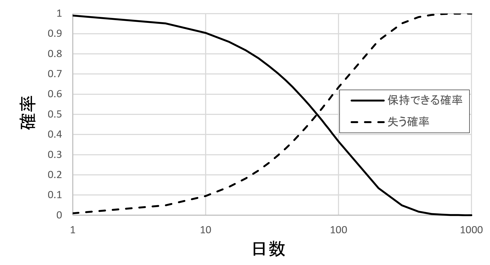

# 人はなぜデータを失うのか？

データを紛失して困ったことはありませんか？

本章では、まずデータをなくす理由についていくつか考えてみましょう。

* HDDなどのデバイスが故障する
* USBドライブなどを落とす(紛失する)
* 間違って消してしまう
* 間違えて上書きしてしまう・保存を忘れる
* ウイルスによりデータが消える・ロックされる
* (ドライブのどこかにあるはずだが)見つからない
* Web上のデータがなくなる(参照できなくなる)
* サーバー・クラウドのトラブル、サービス終了
* その他

いずれも、対応策は異なります。またそれぞれ発生確率は異なります。本書では、データ紛失の原因やその対処法を述べたうえで、データをなくして困る人を減らしたい、あるいは低コストで確実な対応の一案を提示することを目的とします。

例年卒論時期になると、Twitterなどで"卒論データ飛んだorz"などという悲鳴が聞こえてきます。また漫画家さんをはじめ、作成中の原稿が消えた！という嘆きの声もよく聞こえます。

デバイスの故障確率をゼロにすることはできません。しかし、万一デバイス(PCまたはHDDなど)が故障したとしても、バックアップを取っておくなどすることで影響を最小化(理想的にはゼロにする)ことはできます。

ここで簡単な計算をしてみましょう。1日ごとに1%の確率で壊れる(データが飛ぶ)デバイスがあったとします。初日にデータを失う確率は1%です。1日目を無事にデータを保持してやり過ごせる可能性は、100%-1%=99%です。

二日目までにデータを失う確率は、(1日目に失われた確率+1日目に失わなかった確率×2日目に失わなかった確率)で計算でき、1.99%(およそ2%)です。2日目を無事に乗り切れる確率は、(1-失う確率)で計算できるので、およそ98％の確率でデータは保持されます。今のところ、98%の確率で泣かなくて済みます。よかったですね。

{width=90%}

データを失う確率を同様に計算すると、10日で約10%、100日では63%の確率でデータを失うことになります。1日を乗り切ったとしても、日数が経過するごとに無事な確率はどんどん下がってきます。もちろん実際のデバイスの故障率はもっと低いので、そう簡単にデータをなくすことはありませんが、もうしばらくこの思考実験にお付き合いください。

では、同じ故障確率のデバイスを二つ持っていたとして、ここに同じデータを(並行して)保存する癖をつけたとしましょう。片方が壊れても、もう片方に生き残っているデータがあるのでデータは大丈夫！という期待がありますね。

同じように計算してみましょう。ただし、二つの故障確率は独立であるとします。故障確率が独立とは言えない例として、たとえば特定ロットのHDDのようにほぼ同時に寿命が来るなどが挙げられますが、そういった関係はないものとします。

2台のデバイスにデータを並列で保存しているときに1日あたりでデータを失う確率は、2台のデバイスが同時に故障したときに限られます。1台だけが1%の確率で故障しても、もう1台のデバイスがあるのでデータは保持されます。よかったね！同時に故障する確率は、1台目の故障確率×2台目の故障確率で計算でき、1台のときの故障率が1%なので、同時(同じ日)に2台が故障する確率は0.01%になります。したがってある一日にデータが保持される確率は99.99%となります。最初と同じ信頼性のデバイスですが、2台使うだけで故障率は2桁小さくなります。

{width=90%}

1台のときと2台のときで比較すると、10日で10%程度だったデータを失う確率は、およそ0.1%に下がります。100日でおよそ1%、1000日(約3年)で10%になります。かなり現実的な値になったといえるでしょう。

{width=90%}

同じグラフを両対数で表示してみると、故障率が2桁落ちたことがよくわかります。

さて、一日あたりの故障率1%というデバイスはかなり故障率の高いデバイスと言えます。そういったものでも、2台使って相互にバックアップを取るだけでデータを失う可能性を2桁下げることができるということがわかりました。100日あって消失率60%以上というのは実用上許容できない値ですが、100日で1%なら問題ないかもしれません。

ただし、現実的にはデバイス単体の故障率はもっと低いです。しかし低いからこそ、信頼しきったうえでバックアップを取らないなど無防備になってしまうのです。先の計算式をもとに考えると、仮に故障率が0.1%でも、単体運用している場合には100日でおよそ10%の確率でデータが紛失する危険性があることになります。長期間の確率を計算すると、ある程度の日数でデータが失われるリスクが現実的な値としてヒタヒタと近づいてきます。

もう一つ重要なことは、その日にデータが死なないという保証はどこにもないということです。平均故障率が1万分の1(0.0001%)であったとしても、1億分の1であったとしても、それが今日、あるいは明日当たってしまう可能性があります。また、1万分の1でデータが消えるとして、地球人口が60億人とすると、この地球上で毎日60万人のデータが消えている計算になります。あなたがその60万人の一人になる可能性があり、今その瞬間にあたってしまう可能性もあります。もしそれにあたったら、あなたのデータは消えてしまいます。ですが、同様に2個で相互にバックアップを取っていれば、1万分の1は1億分の1になり、データが消えてしまうのは60人で済み、あなたが当たらない可能性はぐんと上がります。

この数字をみるだけで、もう一つバックアップを取ろうかな、と考えてもらえるでしょうか。2つのデバイスでデータを保管するといったちょっとしたことで悲劇を大幅に減らすことができるのです。これが本書全体のテーマでもあり、結論です。

さて、ここまではデバイスの故障を念頭に話をしてきました。何度か述べているように、デバイスが故障する確率はかなり低く、デバイス故障が直接の原因であるデータ消失よりも、人為的ミスなどの方が高い割合であるという報告もあります。

https://www.buffalo.jp/biz/industry/detail/tera-replace-index.html

このグラフによれば、ハードウエアの故障が4割、あとは人的なミス、ソフトウエアの不具合、ウイルスや紛失、破壊(破損)などです。ソフトウエアの不具合は不可抗力である場合もありますが、ざっと半々だと考えると、データを失う確率はさらに上昇します。

それぞれの消失原因やその発生確率はこれから述べていきますが、まずは一定確率でデータを失う可能性がある状況に対し（できるだけ低コストな）対策を講じたいものです。

バックアップのとり方ってどこで学ぶんでしょうか?

学生の頃から音楽CDの取り込み、ポームページの運営、自作小説の執筆、最近では実況動画などの作成なんぞをやっているとバックアップしたいデータがどんどんと増えていきます。このデータ、皆さんはどうやってバックアップをとっているのでしょうか?

これまでは外付けHDDにデータを残す、という運用をしてきました。可搬性が高い2.5インチの外付けHDDを用いており、バックアップしたデータを他人に渡すなんて用途にも利用していました。

最近では動画のバックアップが非常に巨大なファイル（数十GB以上）になるため、可搬性は諦めて容量あたりの単価を重視した3.5インチのHDDを2台用意し定期的に手動でバックアップをとっています。念の為のバックアップなので定期的に忘れずにやりたいのですが、手動だとどうしてもその作業の優先順位は下がってしまいます。

この本によって、より良いバックアップの仕方を学べることを期待しつつ、皆さんのバックアップの仕方なんていうのも感想を兼ねてSNSなどに投稿していただけると嬉しいです。（FORTE）

