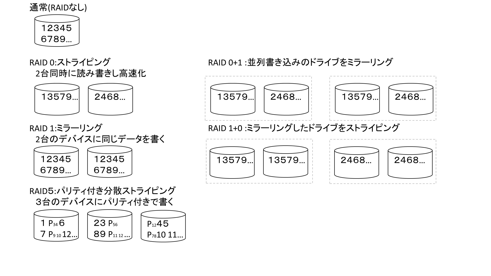

# RAIDで救われるとき、救われないとき

おやかた@oyakata2438

本章では、RAIDについて取り上げます。

## RAIDって何？

まずは、RAIDについて説明しておきましょう。

RAID（Redundant Array of Independent/Inexpensive Disks）は、複数のハードディスクやSSDを組み合わせて、データの冗長性や高速化を実現する技術です。

RAIDにはいくつかのレベル/種類がありますが、実用的に用いられるのはおおよそ以下のものでしょう。

**RAID 0（ストライピング）**：複数のディスクにデータを分散して書き込む。読み書き速度を向上させますが、耐障害性はありません。

**RAID 1（ミラーリング）**：同じデータを2台のディスクに書き込む。片方が故障してもデータを保持できます。

**RAID 10（1+0）**：RAID 1とRAID 0を組み合わせ、冗長性と速度を両立します。

**RAID 5（分散パリティ）**：3台以上のディスクにデータとパリティ情報を分散して書き込む。耐障害性と
データ効率、書き込み速度をバランスする方法。デバイス1台の故障に対応可能です。

**RAID 6 (複数分散パリティ)** : RAID5の発展形で、パリティを2重で書き込むことにより、2台同時故障にも対応します。

デバイス単体で見たとき、RAID 0 は、二つのデバイスに平行して書き込むため、高速な読み書きが期待できます。しかし、2台あるデバイスの片方が故障した場合、すべてのデータが失われます。

一方で、RAID1では、同じデータを2台のデバイスに平行して書き込むため、片側のデバイスが故障しても、データは残ります。そういう意味では、耐障害性は飛躍的に向上するでしょう。しかし、図にある通り、実容量の半分しか使うことができません。

そこで考え出されたのがRAID5です。複数(3台以上)のドライブに、データと、そのデータを復元するためのパリティデータを平行して書き込みます。

図ではP12と書いてありますが、パリティとは、データ1とデータ2から適当な演算(XORが多い)をして、元データを復元できるようにしたエラー訂正用データです。たとえば、データ1が失われても、データ2とパリティP12からデータ1が復元できます。したがって、3台のうち1台が故障してもデータは維持されます。

RAID5の場合、データ領域は全容量の(n-1)/nで使え、図の例の3台のデバイスの場合は、66%の容量が利用できます。RAID1より高効率かつ、ストライピングしている分高速に読み書きできることが期待されます。

さらにパリティを増やしたRAID6もあり、2重パリティを使えば、2台のデバイスの故障までが許容されます。(2台故障の場合はデータが失われないという意味であり、3台目が故障するとデータは失われます)

いったん、RAIDの説明はこれくらいにしておきましょう。

RAIDはサーバーやストレージシステムでよく使われますが、最近では、RAID1に対応するNASや外付けハードディスクも比較的安価に手に入るようになっていますね。

RAID5やRAID6に対応する外付けデバイスは比較的高価です。演算用に高速な処理装置が必要ですから、高価になります。とはいえ、単体のRAIDカードやBoxも(中古を含め)売ってますので、自作する限りにおいては、そうでもないですが…

## RAIDで救われるとき

データ保存領域をRAIDにしたとき、RAIDであったとこにより救われるシチュエーションはなんでしょう。

これは、ひとえに、デバイスの物理故障です。デバイスが1台故障したとき、その中に入っているデータは(基本的に)失われます。RAID1なり、RAID10なり、RAID5で多重化してある場合、デバイスが1台故障してもデータは維持されます。

なお、RAIDとはいっても、RAID 0 は耐障害性はありません。なんなら、「1台故障する確率」より「2台のうちどちらかが故障する確率」の方が当然高いため、耐障害性は単体のデバイスより劣ります。

## RAIDでは救われないとき

**RAIDではデータが救われないとき**はどんなシチュエーションでしょうか？

当然いくつもあります。

### ウイルス、データ誤消去など
デバイスの物理故障以外の、**ウイルスによるデータの消去・ロック・書き換え**などには無力です。

また、同様に、ユーザーの誤操作等を含む、「データの誤消去」なども無力ですね。いくらRAIDで多重化していても、「データを消す」という操作に対しては、「当該デバイスに対してデータを消去する」という命令が走るだけなので、当然データは消えます。

### コントローラーの故障
複数のデバイスに対して書き込みを行う(特にRAID5やRAID0)では、その読み書きを制御するコントローラーが故障すると、データが消失します。データは正しい順番で読んでこそ意味があるので、読みだす順番がわからないと読みだせませんね。もちろん、一定の順序で記録しているので、ビット単位で読んで復元するということも原理的には可能ですが、一般的に労力に見合いません。

同じく、コントローラーを駆動するための電源なども、交換すれば直る可能性があるにせよ、同じ状況を引き起こすことがあります。そのため、ハイエンドなRAIDユニットにおいては、電源やコントローラを含め、多重化している例も少なくありません。

なお、RAID1に限っては、ケースからHDDを引っこ抜いてPCに接続するとそのまま読み出すことができる場合が多いです。単純に「同じデータを2台のデバイスに書き込んでいるだけ」なためですね。

## RAIDはバックアップではない
本章では、RAIDについて説明しました。

RAIDは、お手軽にデータの耐障害性を向上させる技術ですが、その効果と限界を把握して正しく使うことが必要です。

**RAIDはバックアップではない**とはよく言われますが、RAIDにしているから安心、といった間違った安心の仕方をしてはいけません。特に常時PCに接続している状態では、ウイルスや誤消去には全く無力です。

では、隔離して運用すればよいかというと、誤消去の問題の一定の対策にはなりますが、同期の問題が生じますね。

## そのうえで一般人の最適解は？
個人が数テラバイト程度のデータを保管する場合の最適解は、RAID1の外付けHDDを購入することであると考えます。

一般にHDDの故障リスクが(相対的には)最も高く、データが失われる可能性が高いところ、HDD(記録デバイス部)は2重化されているので、ある程度の耐障害性を持ちます。また、電源やコントローラーの故障にあっても、HDD単体を引っこ抜いてPCに繋げばデータは保持されます。

そして、個人で利用する場合は、コストも重要なファクターです。基本的に耐障害性を挙げるほどコスト（お金、消費電力、体積など）も上昇します。シンプルなRAID1の外付けドライブならば、2-3万円からの価格で各社から出ていますし、本体（ケースのみ）なら1万円を切る程度からでもありますので、好きな容量のHDDを入れれば良いでしょう。

RAID5は2-3TBの個人データの運用には不向きと考えます。コントローラーや電源の故障を考えると、案外耐障害性は高くないですし…。なお逸範の誤家庭はこの限りではありません...好きにやってください。